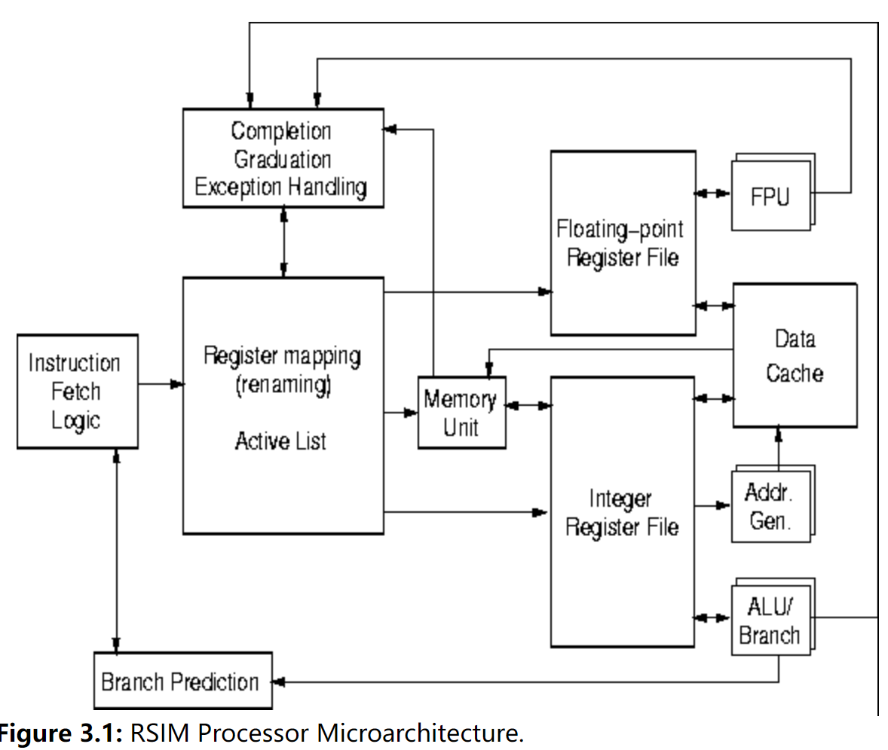

# Rice simulator

## Abstract

RSIM simulates shared-memory multiprocessors (and uniprocessors) built from processors that aggressively exploit instruction-level parallelism (ILP). RSIM is execution-driven and models state-of-the-art ILP processors, an aggressive memory system, and a multiprocessor coherence protocol and interconnect, including contention at all resources.

### Processor simulation features

- Multiple instruction issue
- Out-of-order scheduling
- Register renaming
- Static and dynamic branch prediction
- Non-blocking loads and stores
- Speculative load execution before prior stores are disambiguated
- Optimized memory consistency implementations

### Memory simulation features

- Two-level cache hierarchy
- Multiported and pipelined L1 cache, pipelined L2 cache
- Multiple outstanding cache requests
- Memory interleaving
- Software-controlled non-binding prefetching

### Multiprocessor system features

- CC-NUMA shared-memory system with directory-based coherence
- Support for MSI or MESI cache coherence protocols
- Support for sequential consistency, processor consistency, and release consistency
- Wormhole-routed mesh network

## Docs

read [here](./docs/html/manual.html)

### Microarchitecture

